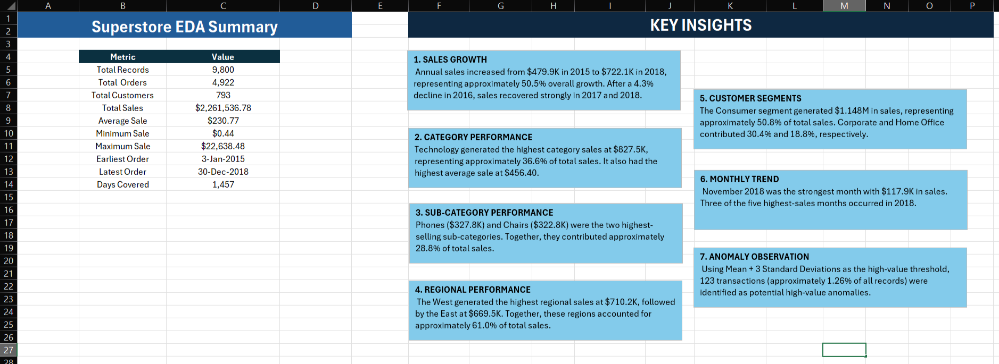
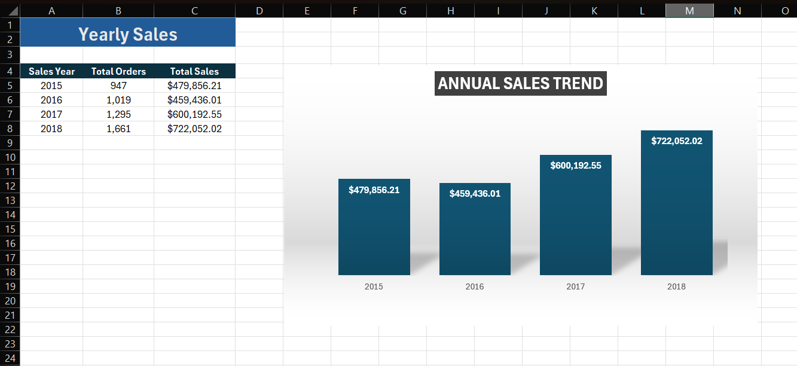
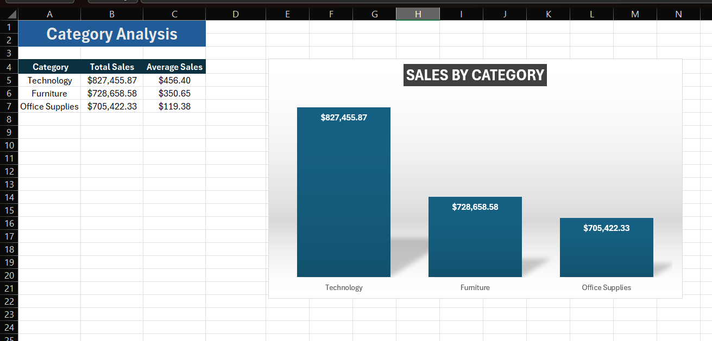
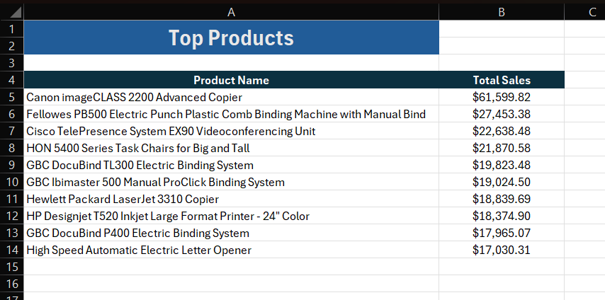

# SWYNEX Exploratory Data Analysis - Task 2
## Project Overview
This project was completed as Task 2 of my Data Analytics Internship with SWYNEX Technologies.

The objective was to perform Exploratory Data Analysis (EDA) on the cleaned Superstore dataset prepared during Task 1.

I used MySQL to calculate summary statistics, analyze trends and patterns, compare sales performance across different business dimensions, and identify potential high-value anomalies. Microsoft Excel was used to organize the SQL results, create visualizations, and summarize the key findings.

## Dataset
Dataset: Superstore Sales Forecasting

Source: Kaggle

Dataset Link: https://www.kaggle.com/datasets/rohitsahoo/sales-forecasting

The cleaned dataset produced during Task 1 was used for this analysis.

Dataset Overview
Records: 9,800
Columns: 18
Unique Orders: 4,922
Unique Customers: 793
Analysis Period: January 2015 - December 2018
Total Sales: $2,261,536.78
Tools Used
MySQL
MySQL Workbench
Microsoft Excel
GitHub
EDA Workflow
The analysis followed these steps:

Imported the cleaned dataset from Task 1 into MySQL.
Validated important fields before analysis.
Converted analytical columns to appropriate data types.
Calculated overall summary statistics.
Analyzed yearly and monthly sales trends.
Compared category and sub-category performance.
Analyzed regional and state-level sales.
Compared customer segment performance.
Identified top-performing products.
Examined the sales distribution.
Investigated potential high-value anomalies.
Organized the SQL results in Excel.
Created charts for important trends and patterns.
Summarized the major findings and insights.
## 1. EDA Summary
The overall analysis covered 9,800 sales records representing 4,922 unique orders and 793 customers.

Key statistics:

Total Records: 9,800
Total Orders: 4,922
Total Customers: 793
Total Sales: $2,261,536.78
Average Sale: $230.77
Minimum Sale: $0.44
Maximum Sale: $22,638.48
Earliest Order: 03-Jan-2015
Latest Order: 30-Dec-2018
Days Covered: 1,457
The EDA Summary worksheet combines the main statistics and insights identified during the analysis.

## 2. Annual Sales Trend
Annual sales were analyzed from 2015 through 2018.

2015: $479,856.21
2016: $459,436.01
2017: $600,192.55
2018: $722,052.02
Sales declined slightly in 2016 before increasing strongly during 2017 and 2018.

Overall sales increased by approximately 50.5% between 2015 and 2018.

## 3. Monthly Sales Trend
Monthly sales were analyzed to understand short-term changes and identify particularly strong sales periods.

The five highest-sales months were:

November 2018: $117,938.16
December 2017: $95,739.12
September 2018: $86,152.89
December 2018: $83,030.39
September 2015: $81,623.53
November 2018 was the strongest individual month in the dataset.

Three of the five highest-sales months occurred during 2018, supporting the overall upward trend seen in the annual analysis.

## 4. Category Analysis
Sales were compared across the three major product categories.

Technology: $827,455.87
Furniture: $728,658.58
Office Supplies: $705,422.33
Technology generated the highest total sales and contributed approximately 36.6% of overall sales.

Technology also recorded the highest average sale at approximately $456.40.

## 5. Sub-Category Analysis
The analysis was extended to individual product sub-categories.

The five highest-selling sub-categories were:

Phones: $327,782.45
Chairs: $322,822.73
Storage: $219,343.39
Tables: $202,810.63
Binders: $200,028.79
Phones were the highest-selling sub-category, narrowly ahead of Chairs.

Phones and Chairs together contributed approximately 28.8% of overall sales.

Fasteners recorded the lowest sub-category sales at approximately $3,001.96.

## 6. Regional Analysis
Sales performance was compared across the four geographical regions.

West: $710,219.68
East: $669,518.73
Central: $492,646.91
South: $389,151.46
The West generated the highest regional sales, followed by the East.

Together, the West and East accounted for approximately 61% of total sales.

The West also had the highest order volume, while the South recorded the lowest sales and order volume.

## 7. Customer Segment Analysis
Sales were analyzed across the three customer segments.

Consumer: $1,148,060.53
Corporate: $688,494.07
Home Office: $424,982.18
Their approximate contributions to total sales were:

Consumer: 50.8%
Corporate: 30.4%
Home Office: 18.8%
The Consumer segment therefore represented slightly more than half of overall sales.

## 8. Top States Analysis
State-level sales were analyzed to identify the ten states generating the highest sales.

This analysis provides a more detailed geographical view beyond the four regional groups.

The complete Top 10 state results are available in the Excel workbook.

## 9. Top Products Analysis
The ten products generating the highest total sales were identified using SQL.

Product-level analysis helps identify individual products making particularly large contributions to overall sales.

Because product names are relatively long, the results were presented primarily as a formatted Excel analysis rather than an additional chart.

## 10. Anomaly Analysis
The distribution of individual sales records was examined to identify unusually high-value transactions.

Sales distribution statistics:

Average Sale: $230.77
Standard Deviation: $626.62
Minimum Sale: $0.44
Maximum Sale: $22,638.48
Potential high-value anomalies were identified using the statistical threshold:

Mean + 3 Standard Deviations

The resulting high-value threshold was approximately $2,110.63.

A total of 123 transactions exceeded this threshold, representing approximately 1.26% of all 9,800 records.

These transactions are statistically unusual because their sales values are substantially higher than the overall distribution. However, they should not automatically be interpreted as data errors because they may represent legitimate high-value transactions.

The ten highest-value individual sales records were also examined as part of the analysis.

# Key Insights
## 1. Strong Overall Sales Growth
Annual sales increased from approximately $479.9K in 2015 to $722.1K in 2018, representing approximately 50.5% overall growth.

After a slight decline in 2016, sales recovered strongly during 2017 and continued growing during 2018.

## 2. Technology Was the Highest-Performing Category
Technology generated approximately $827.5K in sales and contributed approximately 36.6% of total sales.

It also recorded the highest average sale among the three major categories.

## 3. Phones and Chairs Led Sub-Category Sales
Phones generated approximately $327.8K, while Chairs generated approximately $322.8K.

Together, these two sub-categories contributed approximately 28.8% of overall sales.

## 4. West and East Led Regional Sales
The West generated approximately $710.2K, followed by the East at approximately $669.5K.

Together, these two regions accounted for approximately 61% of total sales.

## 5. Consumer Was the Largest Customer Segment
The Consumer segment generated approximately $1.148M and represented approximately 50.8% of overall sales.

Corporate represented approximately 30.4%, while Home Office represented approximately 18.8%.

## 6. November 2018 Was the Strongest Sales Month
November 2018 generated approximately $117.9K, making it the highest-sales month during the analysis period.

Three of the five highest-sales months occurred during 2018.

## 7. High-Value Transactions Were Relatively Uncommon
Using Mean + 3 Standard Deviations as the threshold, 123 transactions were identified as potential high-value anomalies.

These represented approximately 1.26% of all records.

## SQL Analysis
   The project contains three SQL scripts that separate the database setup, validation, and exploratory analysis.

01_database_setup.sql
This script was used to:

Create the MySQL database.
Create the Superstore table.
Import the cleaned CSV dataset.
Verify that all records were imported successfully.
02_data_validation.sql
This script was used to:

Check the imported table structure.
Validate Order Date values.
Validate Ship Date values.
Validate Sales values.
Convert analytical fields to appropriate data types.
Verify the final table structure.
Confirm that all 9,800 records were retained.
Important analytical data types included:

Row ID → INT
Order Date → DATE
Ship Date → DATE
Sales → DECIMAL
Postal Code → VARCHAR
Postal Code remained a text field because Postal Codes are identifiers and may contain leading zeros.

03_exploratory_analysis.sql
The main exploratory analysis includes queries covering:

Overall summary statistics
Dataset time range
Annual sales trend
Monthly sales trend
Category performance
Sub-category performance
Regional performance
Customer segment performance
Top states
Top products
Sales distribution
Highest-value sales records
Highest-sales months
Potential high-value anomalies
Anomaly count
Excel Analysis
The superstore_eda.xlsx workbook contains 10 organized worksheets:

EDA Summary
Yearly Sales
Monthly Sales
Category Analysis
Sub-Category Analysis
Region Analysis
Segment Analysis
Top States
Top Products
Anomaly Analysis
The workbook contains SQL results, summary statistics, charts, anomaly analysis, and key findings from the EDA.

Repository Structure
SWYNEX-Exploratory-Data-Analysis/

data/

superstore_cleaned.csv
sql/

01_database_setup.sql
02_data_validation.sql
03_exploratory_analysis.sql
excel/

superstore_eda.xlsx
screenshots/

01_eda_summary.png
02_annual_sales_trend.png
03_monthly_sales.png
04_category_analysis.png
05_subcategory_analysis.png
06_region_analysis.png
07_segment_analysis.png
08_top_states.png
09_top_products.png
10_anomaly_analysis.png
README.md

Key Learnings
Through this task, I strengthened my practical understanding of:

Exploratory Data Analysis
SQL aggregation and grouping
Summary statistics
Time-based trend analysis
Product performance analysis
Geographic sales analysis
Customer segmentation
Standard deviation
Statistical anomaly identification
Microsoft Excel data visualization
Translating SQL results into meaningful business insights
Organizing and documenting an analytical workflow using GitHub
Final Result
The Exploratory Data Analysis identified meaningful trends and patterns across sales, time, products, geographical regions, customer segments, and unusually high-value transactions.

The project produced more than the required five useful insights while also examining statistical anomalies in the sales distribution.

These findings will serve as the analytical foundation for Task 3 - Interactive Dashboard.

Author
Emmanuel Subek Das

Data Analytics Intern
SWYNEX Technologies

Dataset Source
The original public dataset is available on Kaggle:

https://www.kaggle.com/datasets/rohitsahoo/sales-forecasting

